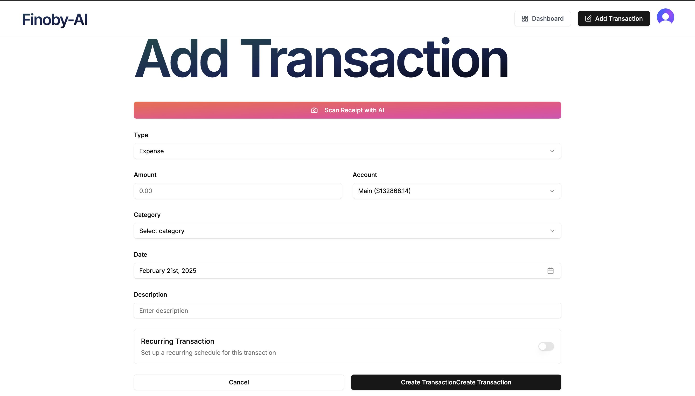
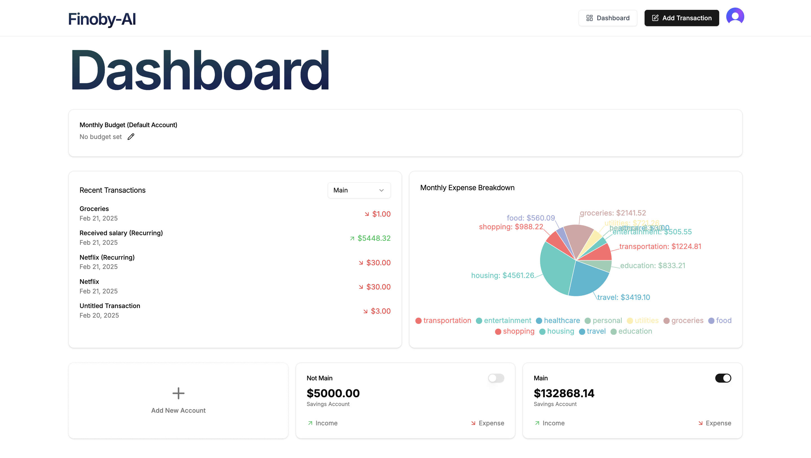
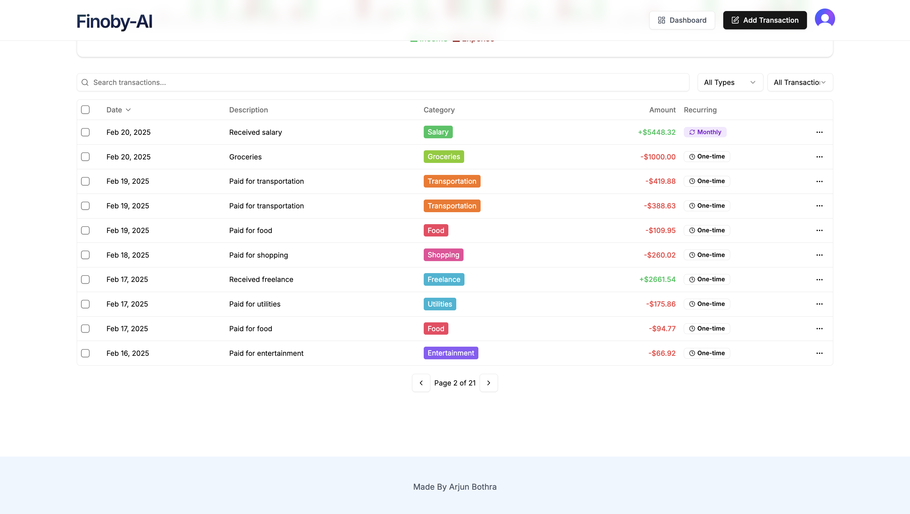
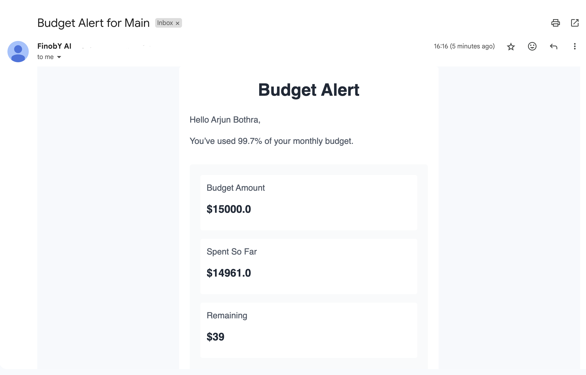
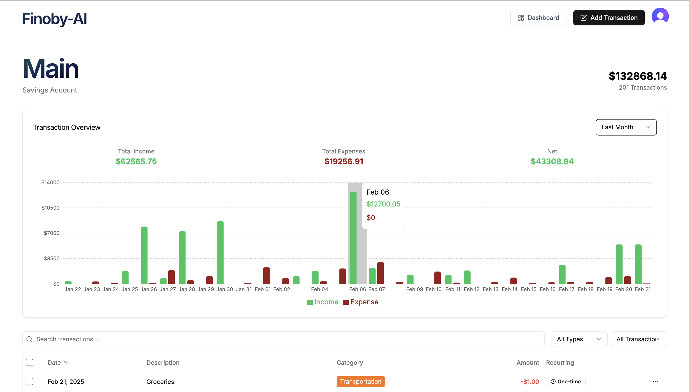
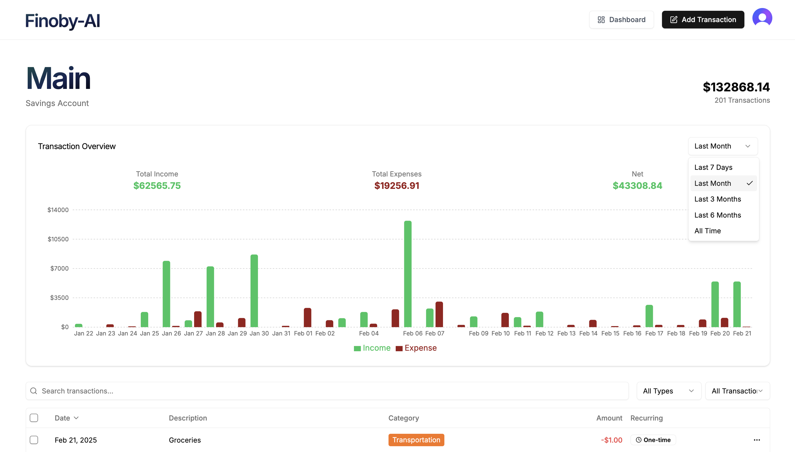
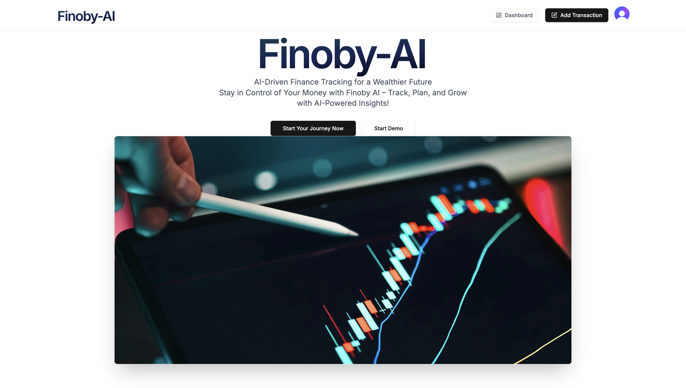

# Finoby AI

## 🚀 Overview

**Finoby AI** is an intelligent finance tracking platform that helps users manage their budgets, track expenses, and analyze financial trends using AI-driven insights. It provides real-time notifications, customizable transaction categories, and detailed financial reports.

## 🌟 Features

- **🔍 AI-Powered Receipt Scanner For Transaction Tracking** – AI Scanner helps automatically categorize and analyze expenses\


- **📊 User Dashboard Real-Time Budget Monitoring** – Set budgets and receive alerts when nearing limits.\


- **📅 Recurring & Non-Recurring Transactions Tracking** – Schedule automatic payments and recurring expenses.\


- **📧 Email Notifications** – Get budget alerts directly via email using Resend and React Emails.\


- **📈 Interactive Charts** – Visualize spending patterns with dynamic graphs.\
  &#x20;
<p align="center">
    
    
  </p>

- **🛠 Full-Stack Architecture** – Built with modern web technologies.\


## 🛠️ Tech Stack

- **Frontend:** Next.js, Tailwind CSS, React
- **Backend:** Next.js
- **Email Services:** Resend, React Emails
- **State Management:** React Hooks
- **Charting:** Recharts

## 🏠 Try it Yourself - Live Demo

🚀 Check out the live version of Finoby AI:\
[**Finoby AI Live**](https://finoby-ai.vercel.app)

## 🛠️ Installation & Setup

1. **Clone the repository**

   ```sh
   git clone https://github.com/arjunbothra/FinobY-AI.git
   ```

2. **Install dependencies**

   ```sh
   npm install
   ```

3. **Set up environment variables**

   - Create a `.env` file in the root directory.
   - Add the required environment variables (e.g., database connection string, API keys).

4. **Run the development server**

   ```sh
   npm run dev
   ```

   Open [http://localhost:3000](http://localhost:3000) to view the app in your browser.

## 📧 Email Notifications

Finoby AI integrates **Resend** for email alerts. The email templates are built with **React Emails**, allowing dynamic and responsive email designs.

## 🤝 Contributing

Contributions are welcome! Feel free to open issues or submit pull requests.

## 📞 Contact

For support or collaboration, reach out via:\
[LinkedIn - Arjun Bothra](https://www.linkedin.com/in/arjunbothra02)


